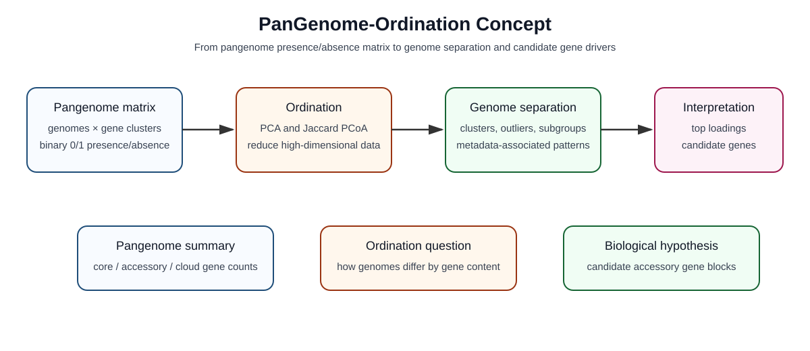
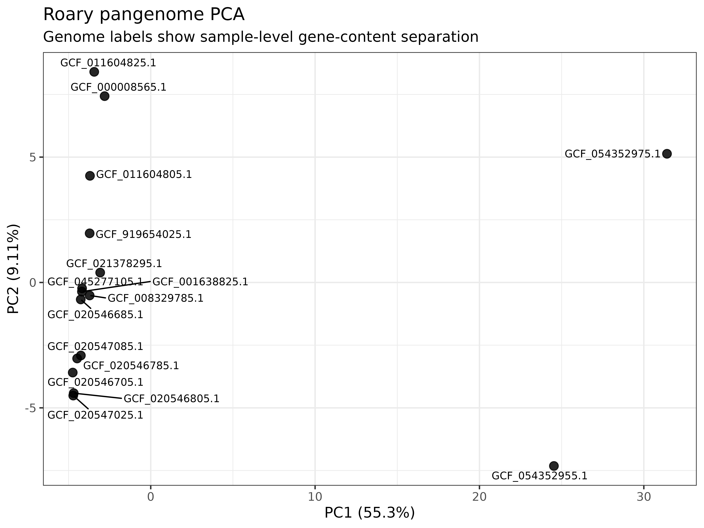
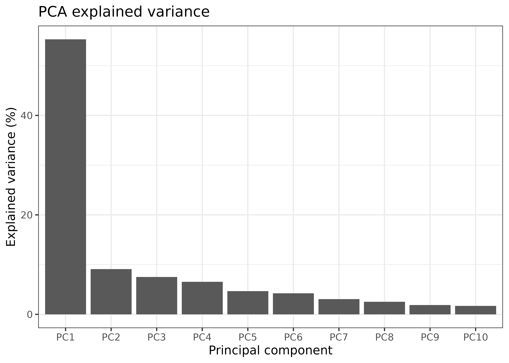
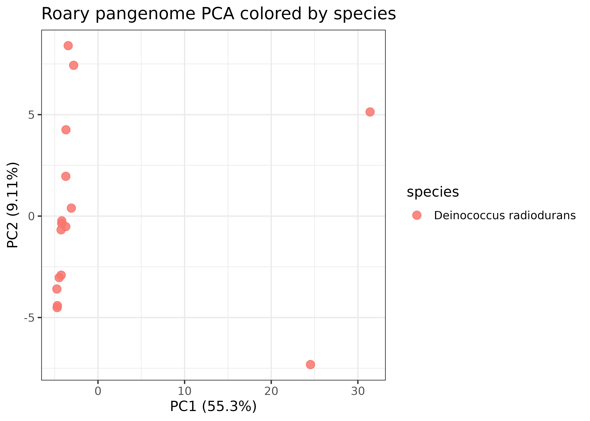
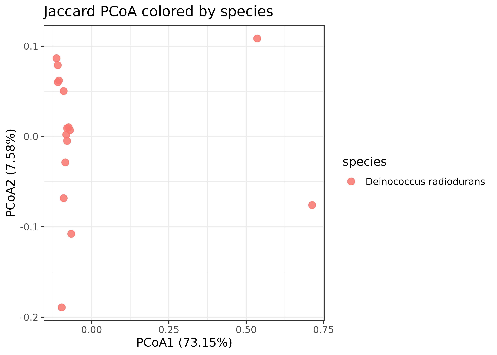

# PanGenome-Ordination


> PCA and PCoA of pangenome gene presence/absence data.

**PanGenome-Ordination** is a reproducible workflow for ordination-based analysis of pangenome gene presence/absence matrices. It supports PCA, Jaccard-distance PCoA, metadata-based visualization, explained-variance analysis, annotated gene loadings, and extraction of candidate gene clusters driving genome separation.

---

## Visual Concept

<p align="center">
  
</p>

**PanGenome-Ordination** starts from a binary pangenome gene presence/absence matrix and uses ordination methods such as PCA and Jaccard-distance PCoA to reveal genome-level structure. Pangenome summaries describe how frequently genes occur, while ordination shows how genomes are arranged based on shared and variable gene content.

---

## Why This Workflow Exists

Pangenome tools can classify genes as core, accessory, shell, or cloud. That is useful, but it mainly describes gene frequency.

Ordination asks a different question:

**How are genomes arranged based on thousands of gene presence/absence features?**

| Analysis | Main question | Output |
|---|---|---|
| Pangenome summary | How frequent is each gene cluster? | Core/accessory/cloud categories |
| PCA / PCoA | How are genomes structured by gene-content variation? | Genome separation, outliers, clusters, candidate drivers |

---

## Core Workflow

```text
pangenome gene presence/absence matrix
        ↓
genomes = samples
gene clusters = features
        ↓
remove zero-variance genes
        ↓
PCA and Jaccard PCoA
        ↓
ordination plots
        ↓
PCA loadings
        ↓
annotated candidate genes
        ↓
biological interpretation
```

---

## Example Output Figures

### PCA of pangenome gene presence/absence data

<p align="center">
  
</p>

### PCA explained variance

<p align="center">
  
</p>

### Metadata-colored PCA

<p align="center">
  
</p>

### Jaccard-distance PCoA

<p align="center">
  
</p>

---

## Input Files

Current implementation is optimized for Roary-style output.

Place input files here:

```text
data/roary/gene_presence_absence.Rtab
data/roary/gene_presence_absence.csv
```

| File | Purpose |
|---|---|
| `gene_presence_absence.Rtab` | Main binary gene presence/absence matrix |
| `gene_presence_absence.csv` | Annotation file used to annotate PCA loadings |
| `data/metadata/metadata.tsv` | Optional metadata for coloring and interpretation |

---

## Installation

```bash
conda env create -f environment.yml
conda activate roarypanpca
```

Verify:

```bash
Rscript -e "library(data.table); library(tidyverse); library(ggrepel); library(vegan); cat('R packages OK\n')"
python -c "import pandas as pd; print('Python OK')"
```

---

## Quick Start With Example Data

```bash
cp examples/toy_gene_presence_absence.Rtab data/roary/gene_presence_absence.Rtab
cp examples/toy_gene_presence_absence.csv  data/roary/gene_presence_absence.csv
cp examples/toy_metadata.tsv              data/metadata/metadata.tsv

bash scripts/run_pipeline.sh
```

---

## Run With Your Own Roary Output

```bash
cp /path/to/gene_presence_absence.Rtab data/roary/gene_presence_absence.Rtab
cp /path/to/gene_presence_absence.csv  data/roary/gene_presence_absence.csv
```

Create taxonomy metadata if needed:

```bash
python scripts/01_make_taxonomy_metadata.py \
  --rtab data/roary/gene_presence_absence.Rtab \
  --species "Deinococcus radiodurans" \
  --genus "Deinococcus" \
  --family "Deinococcaceae" \
  --order "Deinococcales" \
  --class_name "Deinococci" \
  --phylum "Deinococcota" \
  --out data/metadata/metadata.tsv
```

Run:

```bash
bash scripts/run_pipeline.sh
```

---

## Main Outputs

| Output | Meaning |
|---|---|
| `results/qc/input_qc_report.txt` | Input file checks |
| `results/matrix/pca_matrix_genomes_by_genes.tsv` | Transposed genome-by-gene matrix |
| `results/matrix/gene_frequency_summary.tsv` | Gene frequency and pangenome class |
| `results/pca/pca_scores_metadata.tsv` | PCA genome coordinates plus metadata |
| `results/pca/pca_explained_variance.tsv` | Explained variance per PC |
| `results/loadings/pca_loadings_annotated.tsv` | Gene loadings merged with annotations |
| `results/loadings/top_PC1_loadings_annotated.tsv` | Top candidate genes contributing to PC1 |
| `results/pcoa/jaccard_pcoa_scores_metadata.tsv` | Jaccard-distance PCoA scores |

---

## Interpretation

High-loading genes are **candidate drivers of gene-content separation**.

Do not overclaim:

```text
PCA alone does not prove adaptation, virulence, selection, or phenotype.
```

Instead, use:

```text
PCA identifies candidate accessory gene clusters contributing to genome separation.
```

---

## Example: Deinococcus radiodurans

In a demonstration analysis of 16 *Deinococcus radiodurans* genomes:

```text
Original Roary gene clusters: 4,272
Variable gene clusters used for PCA: 2,048
Zero-variance gene clusters removed: 2,224
PC1 explained variance: 55.30%
PC2 explained variance: 9.11%
PC3 explained variance: 7.52%
```

Top PC1-loading genes included phage/mobile-element-associated and accessory genes, including `tnpB`, phage terminase, transporters, kinases, radical SAM proteins, and hypothetical proteins. Several top PC1 genes were present in 14 genomes and absent in two genomes, suggesting that PC1 captured a major accessory gene-content pattern.

---

## Citation

If you use this workflow, please cite:

```text
Bilal M. PanGenome-Ordination: PCA and PCoA of Pangenome Gene Presence/Absence Data. GitHub. 2026.
```

Also cite Roary and any R packages used in your analysis.
