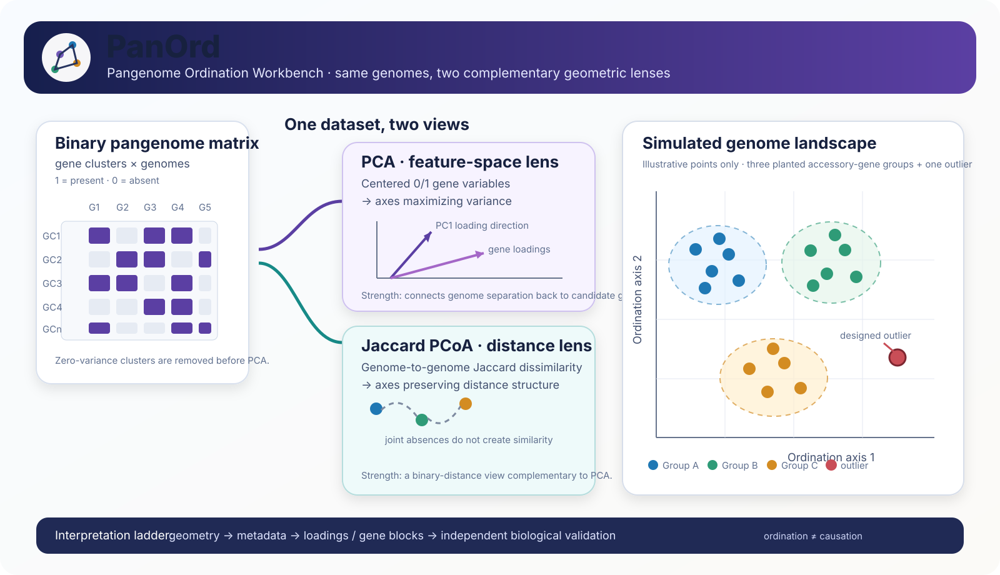

# PanOrd — Pangenome Ordination Workbench

[](https://github.com/mbilal-OU/PanGenome-OrdinationPCA-and-PCoA-of-Pangenome-Gene-Presence-Absence-Data/actions/workflows/test.yml)
[](LICENSE)
[]()
[]()

**PanOrd** is an interpretable ordination workbench for microbial pangenome gene presence/absence data. It combines **PCA**, **Jaccard-distance PCoA**, metadata-aware visualization, PCA loadings, and candidate gene-cluster extraction.

> **Main question:** once a pangenome has been built, how are whole genomes arranged in gene-content space, and which gene clusters contribute to that structure?

<p align="center">
  
</p>

**Start here:** [PCA vs PCoA concepts](docs/PCA_CONCEPTS.md) · [Simulated demo](docs/SIMULATED_DEMO.md) · [Interpretation guide](docs/INTERPRETATION_GUIDE.md) · [Quick start](QUICKSTART.md)

---

## Read the map before the method

A Roary presence/absence table is high-dimensional: each genome is described by hundreds or thousands of binary gene-cluster features. Ordination compresses that space into a few axes so the dominant patterns become visible.

| Lens | Starts from | What it emphasizes | Why use it |
|---|---|---|---|
| **PCA** | genome × gene 0/1 matrix | directions of maximal variance | shows genome structure **and** gives gene loadings that can be traced back to candidate clusters |
| **Jaccard PCoA** | genome × genome Jaccard dissimilarity | pairwise gene-content dissimilarity | treats joint absences as uninformative and provides a complementary distance-based view of binary data |
| **PCA loadings** | PCA rotation coefficients | gene clusters associated with each PC | connects a visible separation pattern back to candidate gene-content features |

These methods are complementary. Agreement between PCA and Jaccard PCoA strengthens confidence that a visible grouping reflects broad gene-content structure rather than one particular geometry.

---

## What are the points, axes and loadings?

**A point is one genome.** Genomes close together have similar gene-content profiles under the geometry used by that ordination; genomes far apart differ more strongly.

**PC1 / PC2 are not genes.** They are new synthetic axes formed from combinations of gene-presence variables. PC1 captures the largest variance direction in the centered matrix, PC2 the largest remaining orthogonal direction, and so on.

**Explained variance tells how much of the matrix variation is represented by an axis.** A large PC1 percentage means one dominant gene-content contrast exists; a small percentage means variation is distributed across more dimensions.

**A loading belongs to a gene cluster, not a genome.** Large positive or negative loadings identify clusters strongly associated with movement along that PC. The sign only gives direction on an arbitrary axis; the magnitude is usually the more useful first screen.

**PCoA axes summarize distances.** With Jaccard dissimilarity, two genomes are compared using shared presences relative to genes present in either genome; genes absent from both do not increase similarity.

See [docs/PCA_CONCEPTS.md](docs/PCA_CONCEPTS.md) for the detailed explanation and methodological caveats.

---

## Why use ordination after Roary?

Roary summary statistics are mostly **gene-centered**:

```text
How many clusters are core?
How many are shell/accessory?
How many are rare/cloud?
```

PanOrd is **genome-centered**:

```text
Do genomes form gene-content groups?
Which genomes are outliers?
Does metadata align with the ordination?
Which gene clusters contribute to a major separation axis?
Do PCA and Jaccard PCoA tell a similar structural story?
```

A pangenome can contain thousands of accessory clusters yet still have little organized genome-level structure—or it can contain a strong block of accessory variation separating a subset of genomes. Ordination distinguishes those situations.

---

## Try the simulated landscape first

PanOrd includes a deterministic simulator so users can learn the method on data where the underlying structure is known.

The demo creates:

- 18 synthetic genomes;
- three labeled genome groups;
- shared core genes;
- group-enriched accessory blocks;
- background accessory variation;
- one deliberately perturbed outlier genome.

```bash
python scripts/00_generate_simulated_pangenome.py \
  --outdir examples/simulated_demo \
  --seed 42

cp examples/simulated_demo/gene_presence_absence.Rtab data/roary/gene_presence_absence.Rtab
cp examples/simulated_demo/gene_presence_absence.csv  data/roary/gene_presence_absence.csv
cp examples/simulated_demo/metadata.tsv               data/metadata/metadata.tsv

bash scripts/run_pipeline.sh
```

Because the group-specific accessory blocks were planted intentionally, the simulated example lets you check whether PCA separates the groups, whether Jaccard PCoA recovers comparable structure, whether the designed outlier moves away from its group, and whether top loadings recover the planted candidate gene blocks.

**All simulated points and gene patterns are explicitly synthetic and are not biological observations.**

[Read the simulated-demo design and expected interpretation →](docs/SIMULATED_DEMO.md)

---

## Run with Roary output

PanOrd currently expects the standard Roary-style files:

```text
data/roary/gene_presence_absence.Rtab
data/roary/gene_presence_absence.csv
```

Optional sample metadata:

```text
data/metadata/metadata.tsv
```

The `.Rtab` file provides the binary matrix. `gene_presence_absence.csv` is used to attach annotations to high-loading gene clusters.

### Installation

```bash
git clone https://github.com/mbilal-OU/PanGenome-OrdinationPCA-and-PCoA-of-Pangenome-Gene-Presence-Absence-Data.git
cd PanGenome-OrdinationPCA-and-PCoA-of-Pangenome-Gene-Presence-Absence-Data

conda env create -f environment.yml
conda activate roarypanpca
```

### Minimal run

```bash
cp /path/to/gene_presence_absence.Rtab data/roary/gene_presence_absence.Rtab
cp /path/to/gene_presence_absence.csv  data/roary/gene_presence_absence.csv
bash scripts/run_pipeline.sh
```

If metadata are absent, the workflow creates genome-only metadata. For meaningful colored plots, provide biological or technical metadata whose genome IDs exactly match the `.Rtab` header.

---

## What the workflow produces

```text
Roary presence/absence
        │
        ├── matrix preparation + zero-variance removal
        │
        ├── PCA
        │    ├── genome scores
        │    ├── explained variance
        │    └── annotated gene loadings
        │
        └── Jaccard dissimilarity
             └── corrected PCoA + eigenvalue diagnostics
```

| Output | Use |
|---|---|
| `results/matrix/pca_matrix_genomes_by_genes.tsv` | variable genome × gene matrix used for ordination |
| `results/matrix/gene_frequency_summary.tsv` | gene prevalence and frequency-class summary |
| `results/pca/pca_scores_metadata.tsv` | genome coordinates on PCA axes |
| `results/pca/pca_explained_variance.tsv` | variance represented by each PC |
| `results/loadings/pca_loadings_annotated.tsv` | gene loadings merged with Roary annotations |
| `results/loadings/top_PC1_loadings_annotated.tsv` | strongest candidate contributors to PC1 |
| `results/pcoa/jaccard_pcoa_scores_metadata.tsv` | Jaccard PCoA genome coordinates |
| `results/pcoa/jaccard_pcoa_eigenvalues.tsv` | PCoA eigenvalues and explained percentages |
| `results/pcoa/jaccard_pcoa_diagnostics.tsv` | additive-correction and distance diagnostics |
| `figures/` | PCA, scree, metadata-colored and Jaccard PCoA figures |

---

## The interpretation ladder

PanOrd encourages interpretation in four steps rather than jumping from a scatter plot directly to biology.

**1. Geometry — describe what is visible.**  
Are there clusters, gradients, overlaps or outliers? How much variance do the displayed PCA axes capture?

**2. Metadata — ask what the geometry aligns with.**  
Color points by species, source, habitat, geography, host, clade, phenotype or other justified metadata. Visual correspondence is exploratory; it is not a formal association test.

**3. Features — trace PCA separation to gene clusters.**  
Inspect high-magnitude loadings and the presence/absence pattern of top clusters. Check whether many high-loading genes share the same distribution pattern, which can indicate a linked accessory block or correlated gene-content event.

**4. Biology — validate the hypothesis independently.**  
Functional annotation, genomic context, phylogeny, population structure, mobile-element analysis, phenotype data or formal association testing may be needed before making causal or adaptive claims.

---

## PCA and binary pangenome data: an important detail

PanOrd uses centered **unscaled PCA** by default (`center = TRUE`, `scale = FALSE`). For a binary variable with prevalence *p*, variance is *p(1-p)*, so intermediate-frequency clusters naturally contribute more variance than very rare or nearly universal clusters.

This is intentional and should be understood when interpreting loadings. Standardizing every binary gene to unit variance can strongly amplify rare features; PanOrd therefore does not do that silently.

Jaccard PCoA provides a useful complementary view because it starts from an asymmetric binary dissimilarity in which shared absences do not count as evidence of similarity.

---

## Scientific guardrails

- **Ordination is exploratory.** Separation does not prove adaptation, phenotype, virulence, selection, or ecological causation.
- **High loadings are candidate contributors**, not automatically causal genes.
- **Closely linked genes can share nearly identical loadings**, so a top-loading list may represent one genomic island, prophage, plasmid or other correlated block rather than many independent effects.
- **Population structure can explain apparent metadata separation.** Compare ordination with phylogeny or lineage assignments where appropriate.
- **Assembly and annotation artifacts can create gene-content outliers.** Inspect genome QC, gene counts and unusual accessory burdens before biological interpretation.
- **Jaccard PCoA can be non-Euclidean.** The workflow now applies an additive correction before ordination and records the correction/eigenvalue diagnostics rather than hiding this issue.

---

## Existing biological demonstration

The repository also retains the existing *Deinococcus radiodurans* demonstration. In that analysis, 4,272 Roary gene clusters were reduced to 2,048 variable clusters for PCA, with PC1 explaining 55.30% of the variance. High PC1 loadings included several mobile-element/phage-associated and accessory annotations.

Those results should remain framed as an **exploratory gene-content pattern**. The simulated tutorial is separate and exists only to teach how a known planted structure behaves under PCA and Jaccard PCoA.

---

## Repository map

```text
PanOrd/
├── README.md
├── QUICKSTART.md
├── environment.yml
├── scripts/
│   ├── 00_generate_simulated_pangenome.py
│   ├── 00_check_inputs.sh
│   ├── 02_prepare_matrix.R
│   ├── 03_run_pca.R
│   ├── 04_extract_loadings.R
│   ├── 05_make_plots.R
│   ├── 09_run_jaccard_pcoa.R
│   └── run_pipeline.sh
├── examples/
├── docs/
│   ├── PCA_CONCEPTS.md
│   ├── SIMULATED_DEMO.md
│   ├── INTERPRETATION_GUIDE.md
│   └── assets/
└── tests/
```

## Citation

Citation metadata are provided in [`CITATION.cff`](CITATION.cff). Please also cite Roary and the statistical/R packages used in analyses derived from this workflow.

## License

MIT. See [`LICENSE`](LICENSE).
